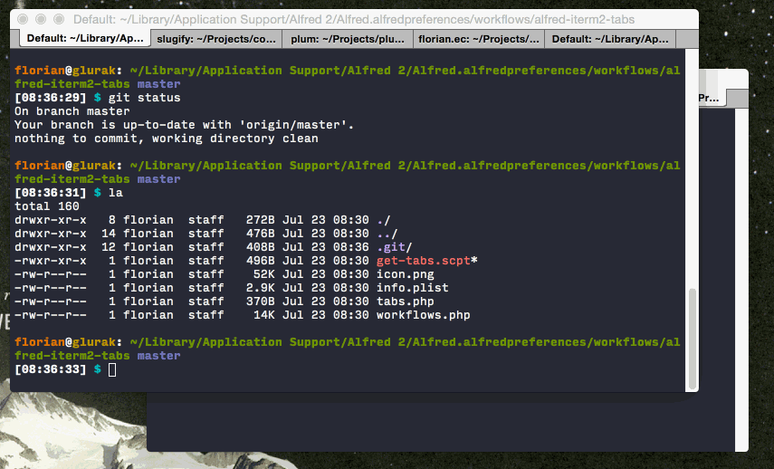

I often have lots of tabs and panes open in [iTerm2](http://iterm2.com) (the best terminal app for OS X) and it takes a while to find the correct one. Therefore I created a workflow for [Alfred](http://www.alfredapp.com) to search through all open tabs and switch to it.

Install it by [downloading the latest version](https://github.com/florianeckerstorfer/alfred-iterm2-tabs/releases/latest) and double-clicking the `alfred-iterm2-tabs.workflow` file. Activate it by using the `itt` keyword.
