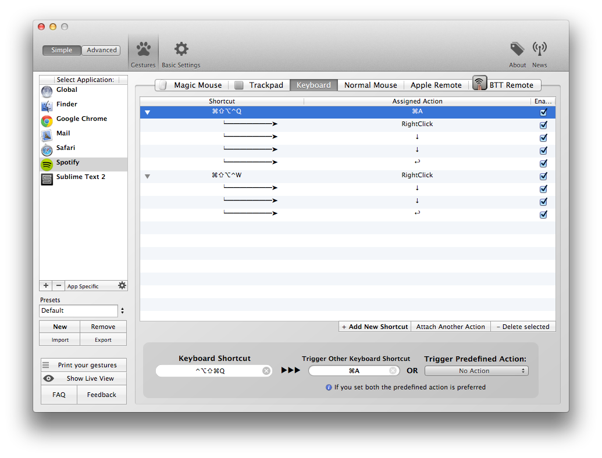

Sadly Spotify misses a lot of useful keyboard shortcuts, but fortunately we can use AppleScript and BetterTouchTool to create a shortcut to add a song to the queue.

I spent the last hour trying to set the easiest and most reliable way to create a keyboard shortcut for Spotifys _Add to Queue_ functionality on OS X. Since I found no solution for this I decided to post it here.

_Update June 14, 2013: In the last update Spotify moved **Queue** in the context menu from the second position to the 6th. I updated the article accordingly (but not the screenshot)._

There is no menu bar entry for this functionality in Spotify and therefore no way to use an ApplyScript. I had to simulate mouse clicks to get this done. There exists a range of different tools to set keyboard shortcuts, but I personally prefer [BetterTouchToul](http://www.bettertouchtool.net) from Andreas Hegenberg.

In the main BetterTouchTool window you first need to add _Spotify_ to the list of applications. Just press the small plus button in the bottom of the list. I created two shortcuts. One for adding all tracks in the current view to the queue and another one for adding all currently selected tracks to the queue.

Let's first create the shortcut for adding all tracks in the current view to the queue. Manually we would first press **Cmd+A** to select all tracks, then click the right mouse button and select the second entry from the context menu. We need to create a new shortcut by pressing the _Add New Shortcut_ button in the lower right corner. Define your favourite shortcut to it (I mapped the CAPSLOCK key to Crtl+Option+Shift+Command and used **CL+Q**) and set _Trigger Other Keyboard Shortcut_ to **Cmd+A**. Click _Attach Another Action_ and set _Trigger Prefefined Action_ to _Rightclick_. Next we need to attach <strike>two</strike> six more actions that <strike>both</strike> all should trigger the _Down_ key. The last action we need to attach is the _Enter_ key.

The shortcut to add only the selected songs to the queue is very similar, just set the shortcut to trigger _Rightclick_ instead of _Cmd+A_.

_Please note that the mouse has to be hovered over the selected songs when triggered the shortcut._

[A useful Caps Lock key - BrettTerpstra.com](http://brettterpstra.com/2012/12/08/a-useful-caps-lock-key/)
