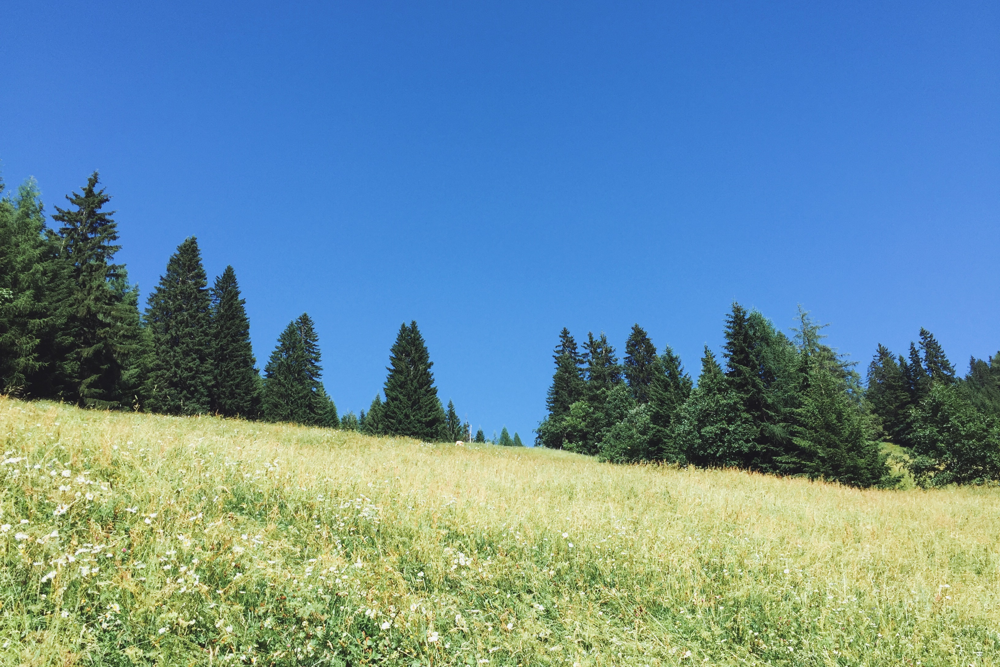
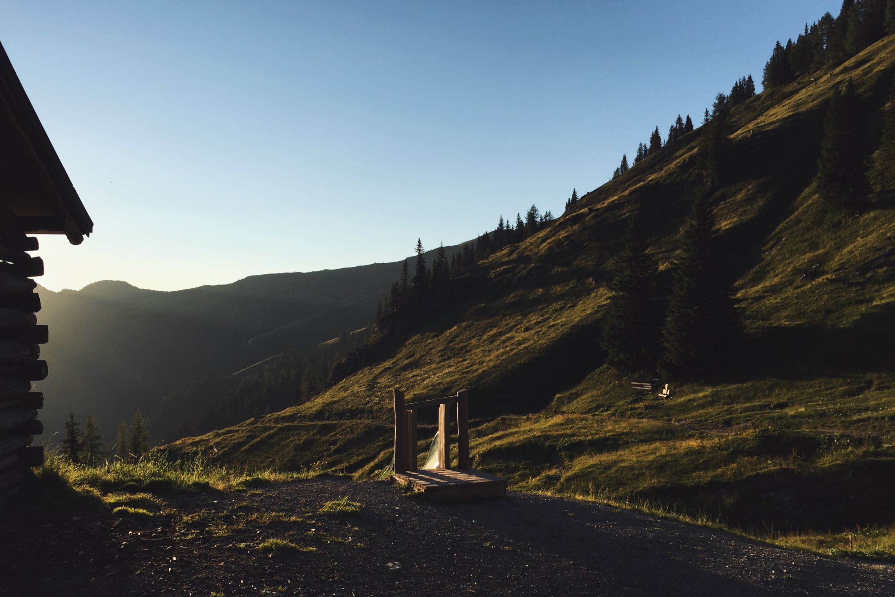
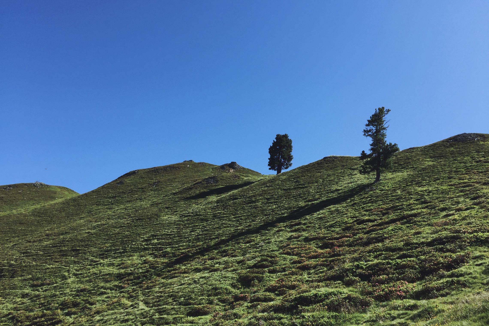
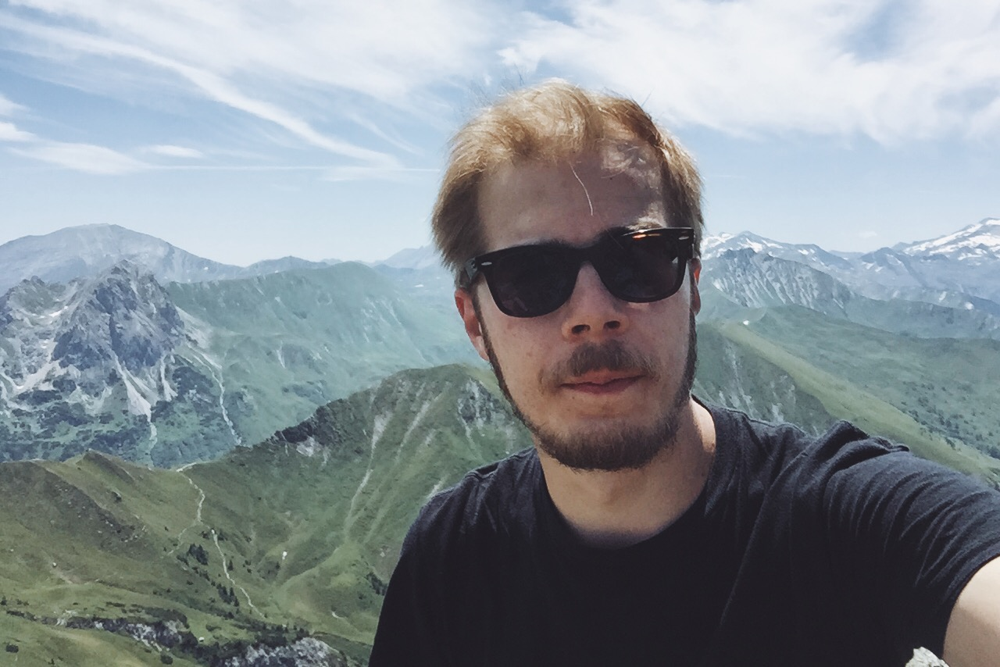
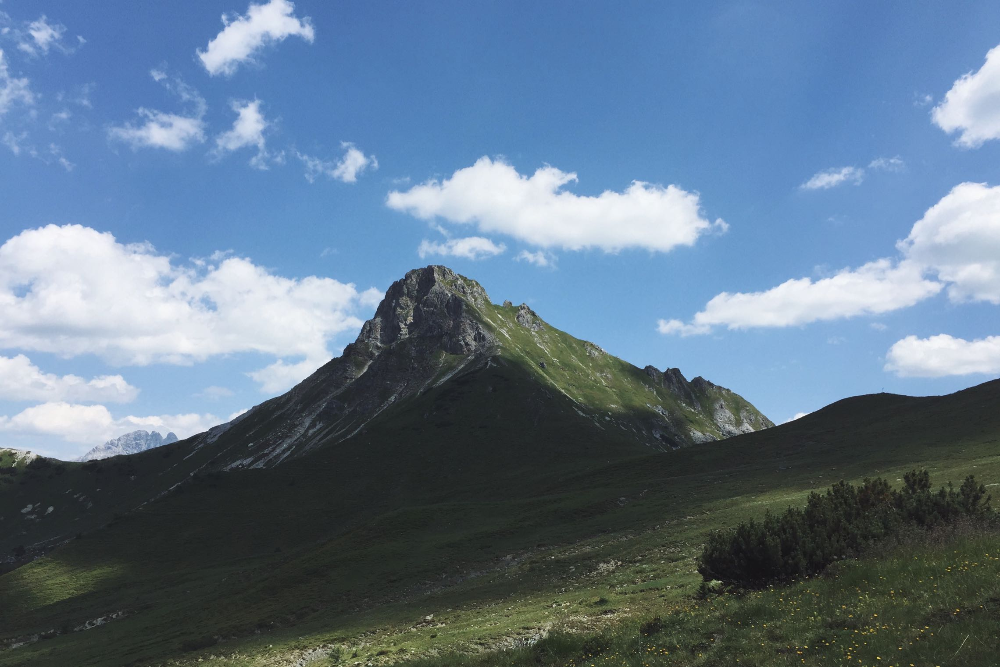
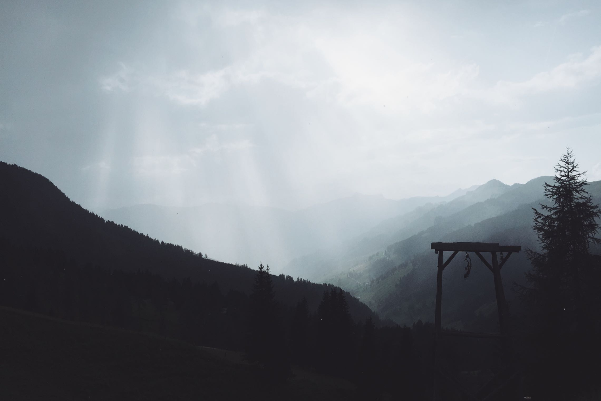
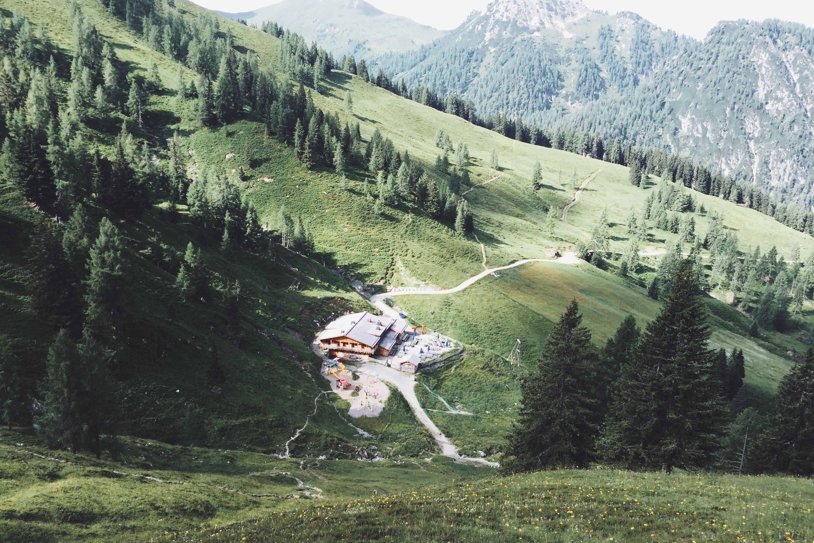
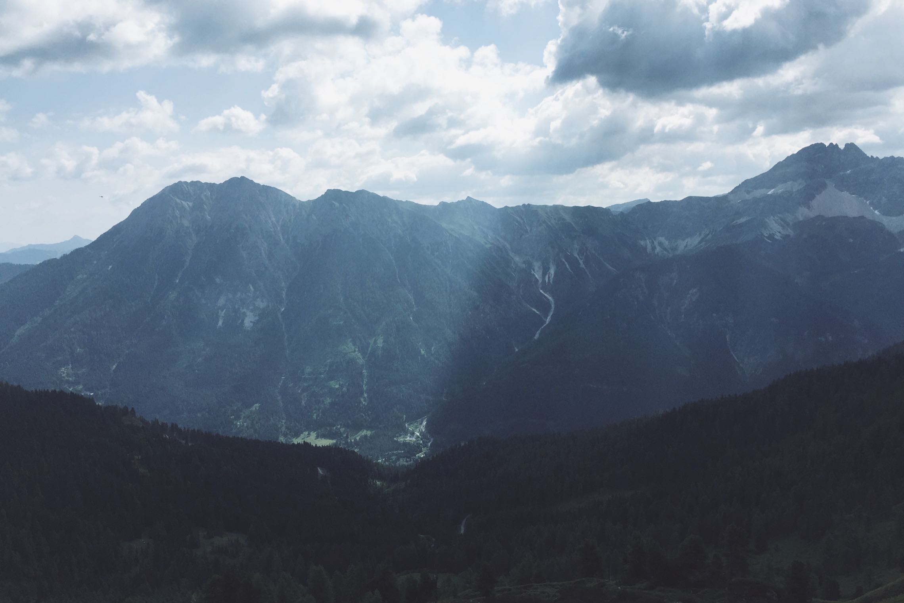
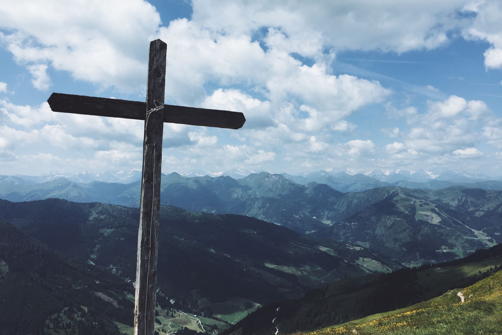
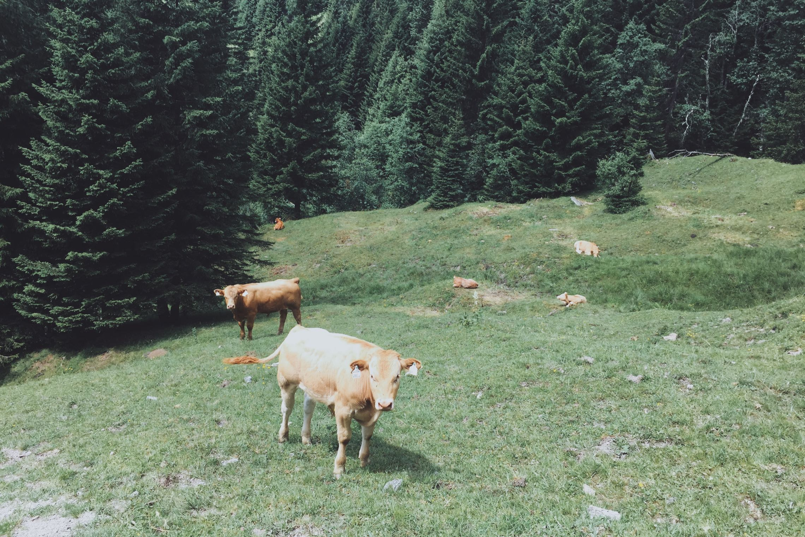

Two weeks ago I was hiking in Großarl, slept at Loosbühelalm and climbed Draugstein (2359m). Here are some pictures.

Ascent to Loosbühelalm from Großarl.

Sundown at Loosbühelalm.

In the morning just after we left Loosbühelalm for Draugstein.

Selfie at Draugstein

Draugstein front and center and Filzmoossattel at the right

After we came back to Loosbühelalm it rained for a while and was foggy, but then the sky started clearing again.

Looking back at Loosbühelalm after we left on the second morning.

We climbed Gründegg (2168m) and got some pretty light and shadow play.

Summit cross at Gründegg

We made some friends on our way down.
