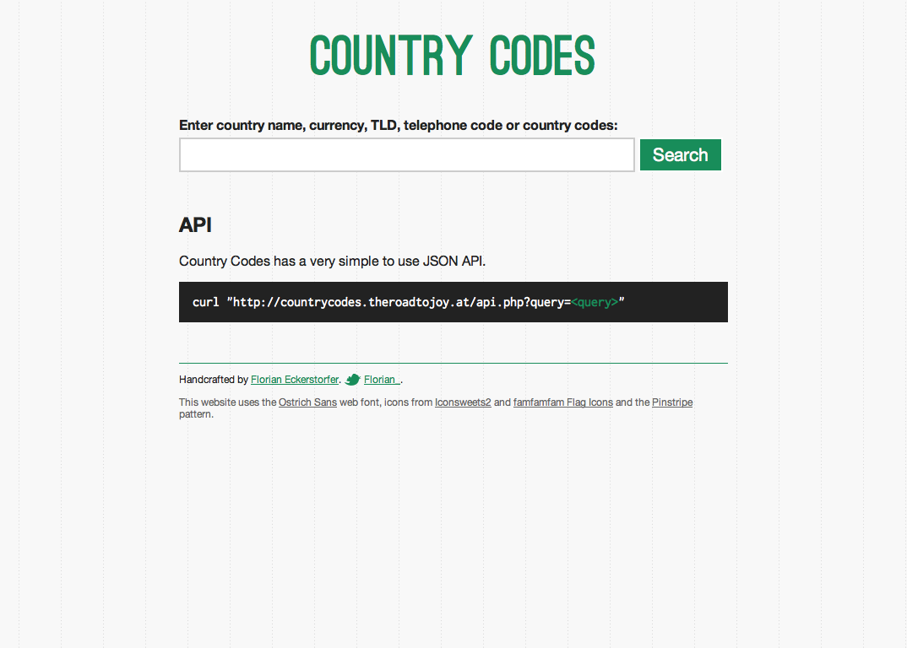
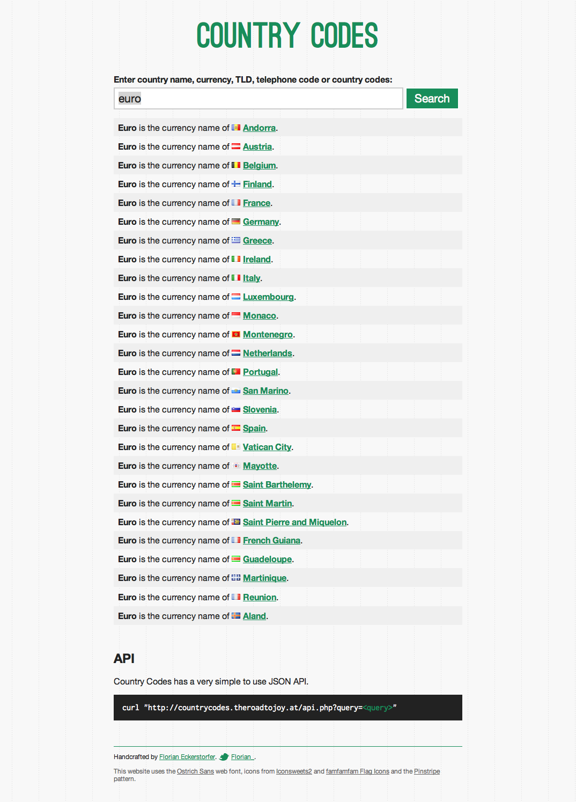
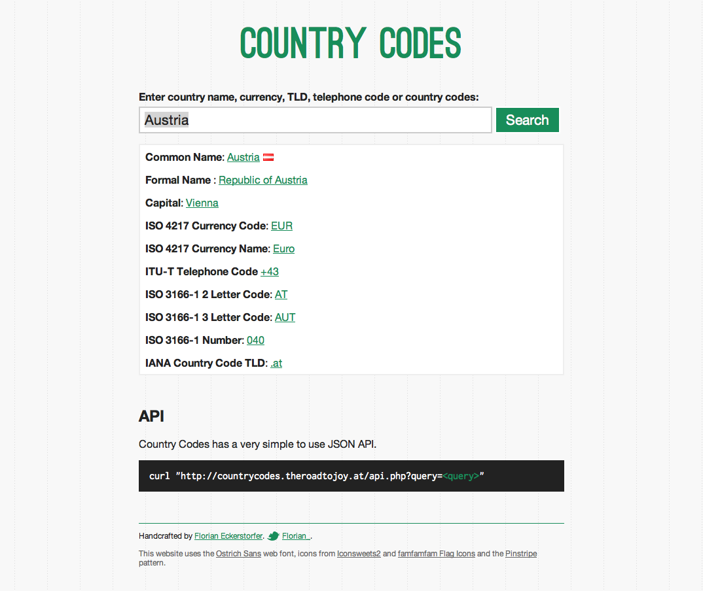

Convert country codes, country names, telephone codes, TLDs and currency codes.

[http://countrycodes.theroadtojoy.at/](http://countrycodes.theroadtojoy.at/)

### Technologies &amp; Libraries<

PHP, HTML, Sass, HTML5 Boilerplate

