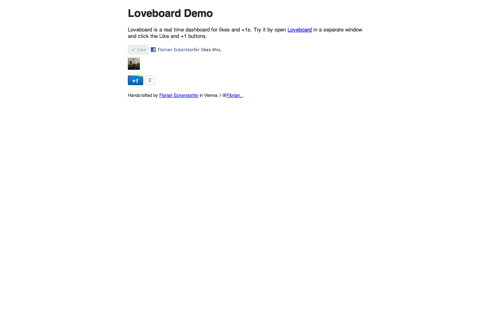
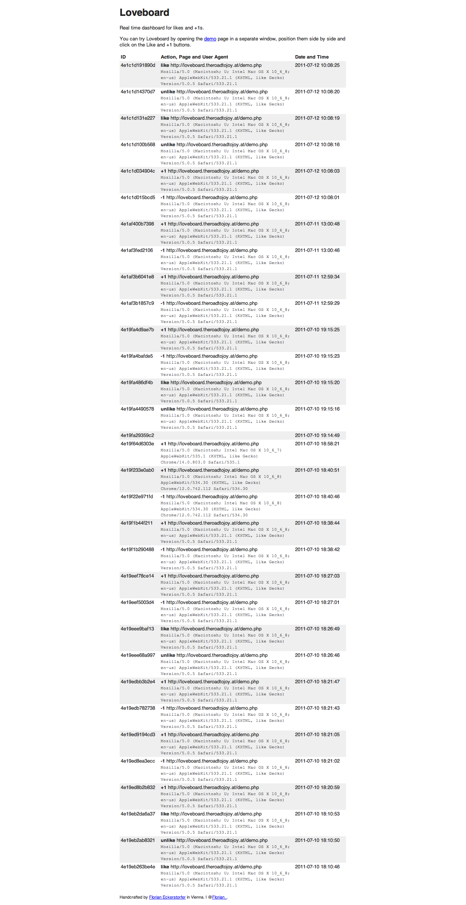

A experimental real time dashboard for likes and +1s. The source code is available on [GitHub](http://github.com/florianeckerstorfer/loveboard).

[http://loveboard.theroadtojoy.at](http://loveboard.theroadtojoy.at)

## Technologies &amp; Libraries

PHP, JavaScript, HTML, CSS, HTML5 Boilerplate, jQuery, Pusher

