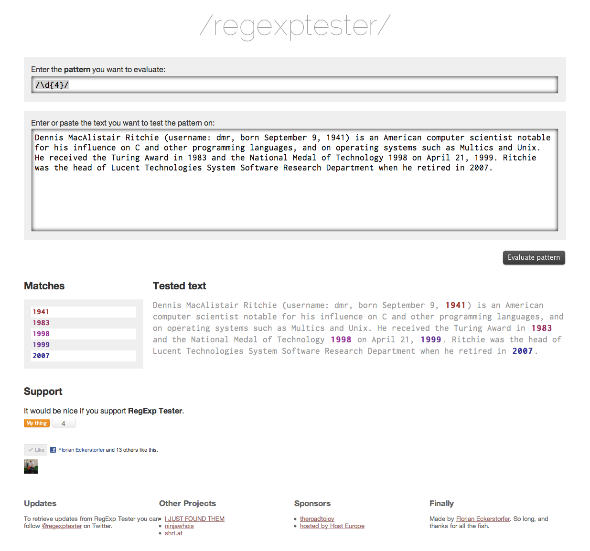

A online service to test and visualize regular expressions.

The project is no longer online and I no longer own the domain name <em>regexptester.com</em>.

## Technologies &amp; Libraries

PHP, HTML, CSS

