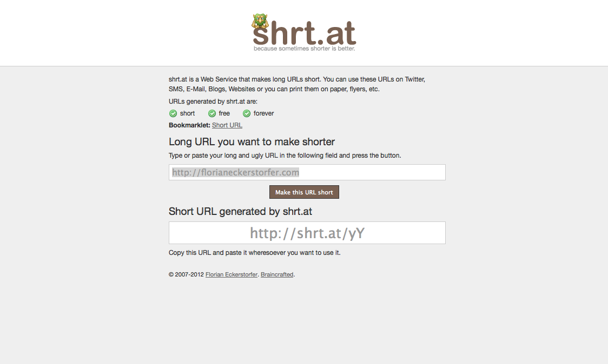

Just another short URL service.

[http://shrt.at](http://shrt.at)

A new version is in development for some time now (with no release in sight). The source code of the new version is open source and on [Github](https://github.com/florianeckerstorfer/shrt.at).

## Technologies &amp; Libraries

PHP, HTML, JavaScript, Smarty, Tomo

