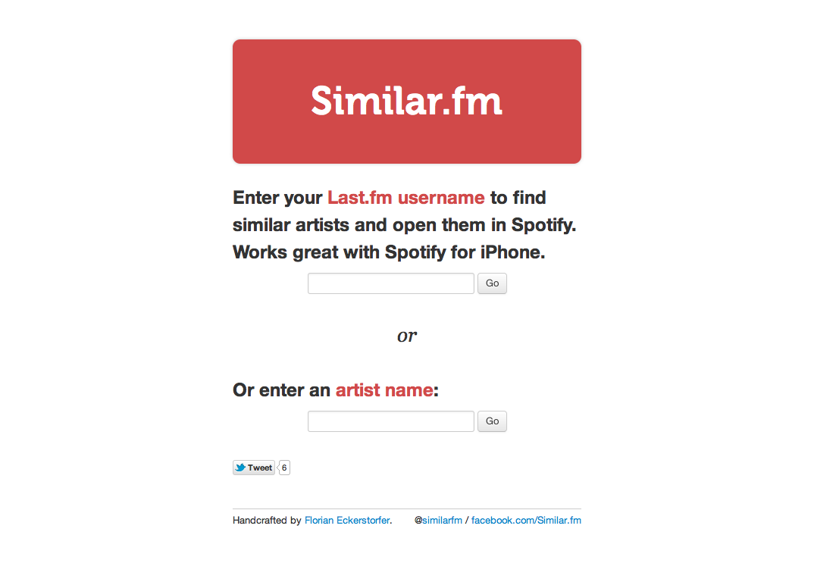

Open artists that are similar to the one your are listening to in Spotify with you one click.

[http://similar.fm](http://similar.fm)

## Technologies &amp; Libraries

PHP, HTML, Bootstrap, LESS, Silex, Twig, Last.fm API, Spotify API

