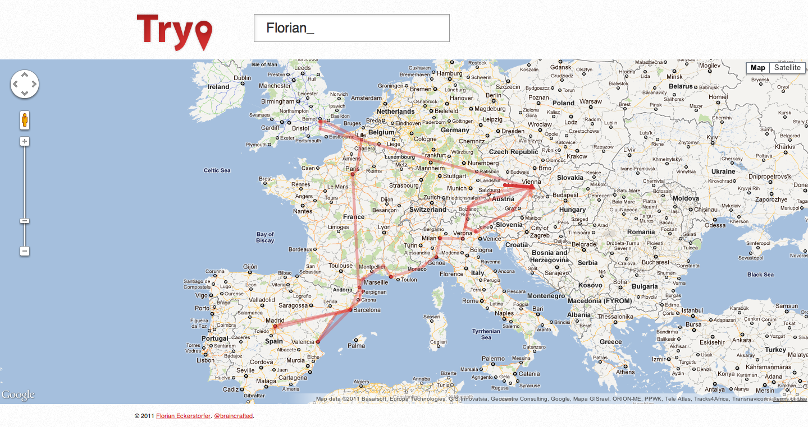

Displays a map with all the places where a Twitter user has been.

[http://trypapp.com](http://trypapp.com) (The app no longer works)

## Technologies &amp; Libraries

PHP, JavaScript, HTML, Sass, HTML5 Boilerplate, Cocur Dispatcher, Twig, jQuery, Google Maps API, Twitter API

