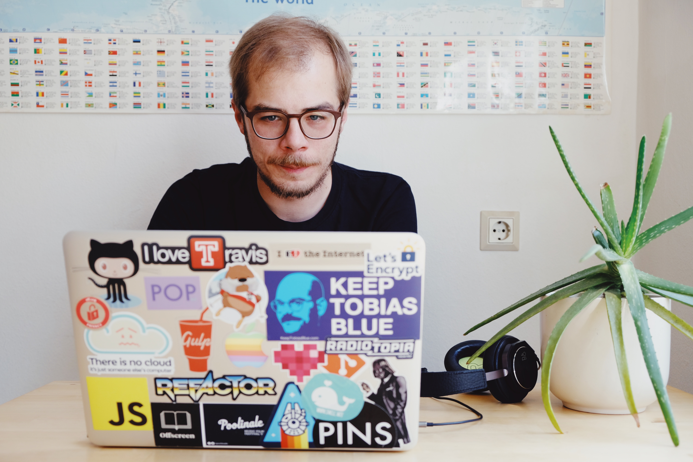

Hello. My name is Florian Eckerstorfer. I am a Web Developer based in Vienna, Europe. When not writing code I like
reading, walking and music. I go to a lot of [🎸 concerts](/concerts) and always want to [🚋 travel](/travel).

You can find me at numerous social networks and web services, including
[Twitter](http://twitter.com/Florian_),
[Pinboard](https://pinboard.in/u:florian.eckerstorfer),
[Instagram](http://instagram.com/florian_) and
[Last.fm](http://www.last.fm/user/feredir)</a>.
You can find code I write on
[Github](https://github.com/florianeckerstorfer),
[Packagist](https://packagist.org/users/florianeckerstorfer/),
[NPM](https://www.npmjs.org/~florianeckerstorfer) and
[RubyGems](https://rubygems.org/profiles/florianeckerstorfer)</a>.
I also like to take [photos](http://42reasons.com) and love to [travel](/travel).

## Biography

I was born and raised in Linz, Austria and graduated from _HLW für Kommunikations- und Mediendesign_, which included an education in Econimics as well as in communication and media design. After school I moved to Vienna to study _Software & Information Engineering_ at the Vienna University of Technology. In July 2011 I received my bachelors degree and started my Masters in _Software Engineering & Internet Computing_. In March 2012 I also began working on a supplement curriculum in _Innovation_, which I received in March 2014. I finsished my Masters studies in January 2018 by writing my thesis on _Machine Learning Approach for Web Ranking Identification based on Visual Features_.

When I was a child I made magazines with friends and sold them to family members. When the Internet became a thing I moved my creative endeavors into the digital space. I tought myself the required design and programming skills and started making websites about stuff I like. After some years of freelancing while in school I started my first serious job at 2beFOUND in Vienna to build web sites and applications. Nowadays I create applications that collect, analyze and move around large amounts of data. In April 2016 I joined the startup [Kiweno](https://kiweno.com) in Vienna as a full time Frontend Developer. Since January 2017 I am working full time at [Swell](https://www.swell.wtf) as Frontend &amp; Mobile App Developer.

I never stopped creating websites and applications about stuff I am passionate about. For multiple years I ran a weblog called [Web Adventures](http://webadventures.at) and I constantly do new, small [projects](/projects/).
