Oslo has been on my list of cities I wanted to visit for some time now and when I saw the lineup of [By:Larm festival](http://bylarm.no) I knew that I needed to go to Oslo in March. Once again my friend Karin decided to join me and here we are, after five days in the capital of Norway in which we saw amazing bands, drank the most expensive beers of our lives, used the subway to get to Oslos skiing area and had a really great time.

I arrived in the late afternoon and after a delicious burger we saw Léonne (Photo), Whitney (Photo), Oscar Blesson and Bea1991 at Pokalen.

On the second day snow from the previous night was still covered the ground of Oslo and we walked around the city. Along Karl johann gate through Slottsparken and around the new waterfront area. We also visited the Astrup Fearnley Museum of Modern Art, drank coffee and ate Kanelbulle. On the way back to our aparment we walked through the old fortress, Akershus festning.

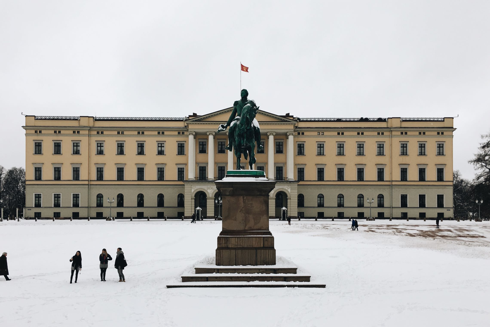

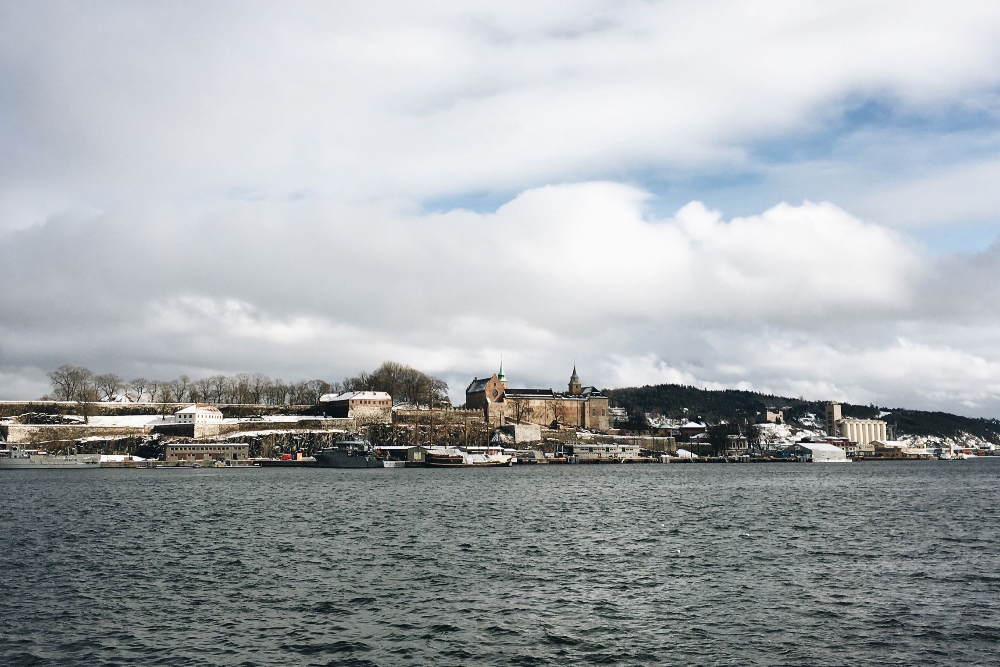

In the evening we attended so many shows. I started with Siv Jakobsen (photo) and Karin later joined me at Café Mono for Pale Honey (photo), Ida Stein (photo) at Sentrum Scene, Charlotte Dos Santos at Gamla, Abra (photo) at Internasjonalen, Little Jinder at Drømmelteltet and Dolores Haze (photo) at Verkstedet.

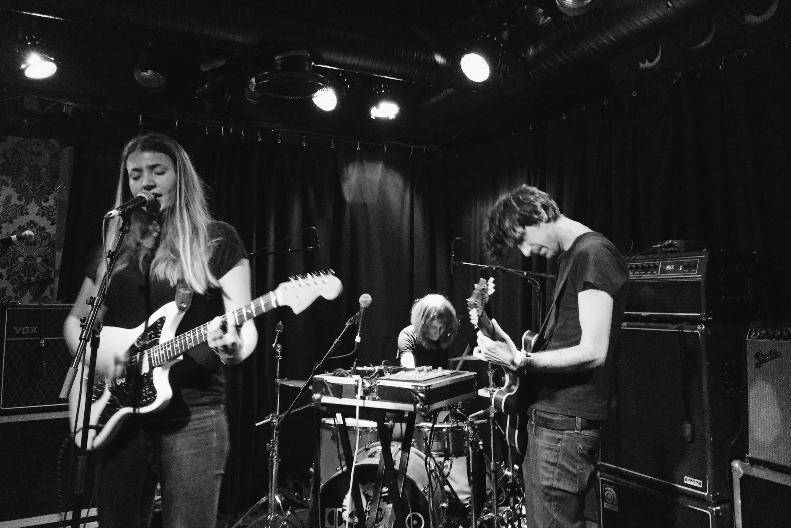

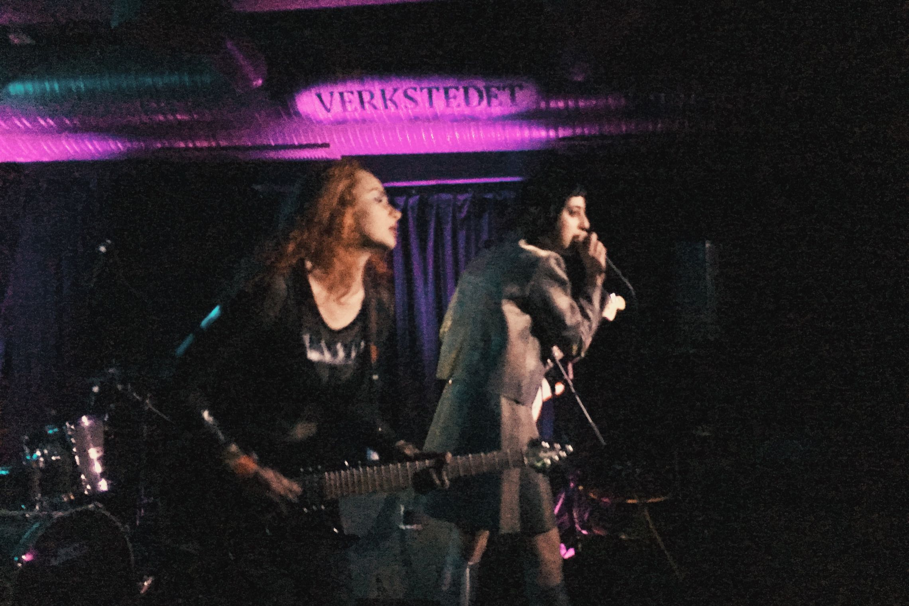

On Friday we went to the Munch Museum where there was an amazing Munch+Mapplethorpe exhibition and later we took a ferry trip around the islands in the Oslo Fjörd. We had more coffee and kanelbulle and ate another great burger and Illegal Burgers.

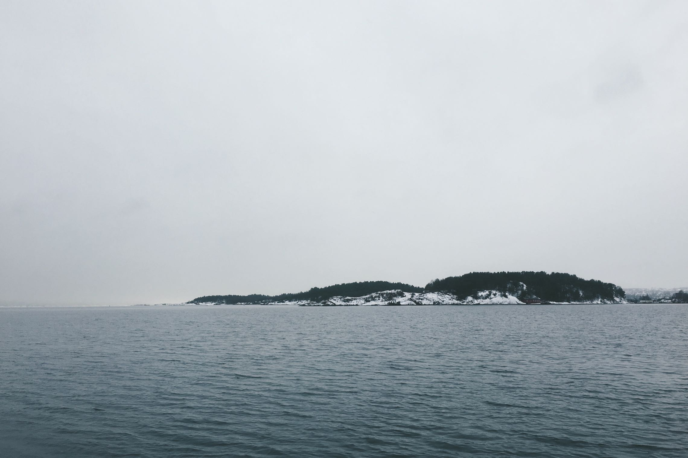

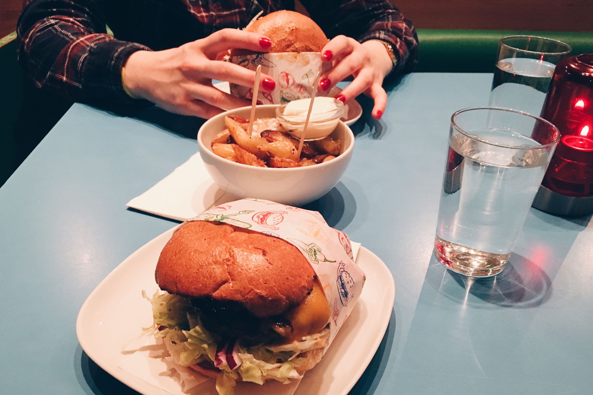

We saw Sea Lion (photo) and Alice Boman (photo) at St. Edwards Church, Kwamie Liv (photo) at Sentrum Scene and then again at St. Edwards Church Pixx (photo).

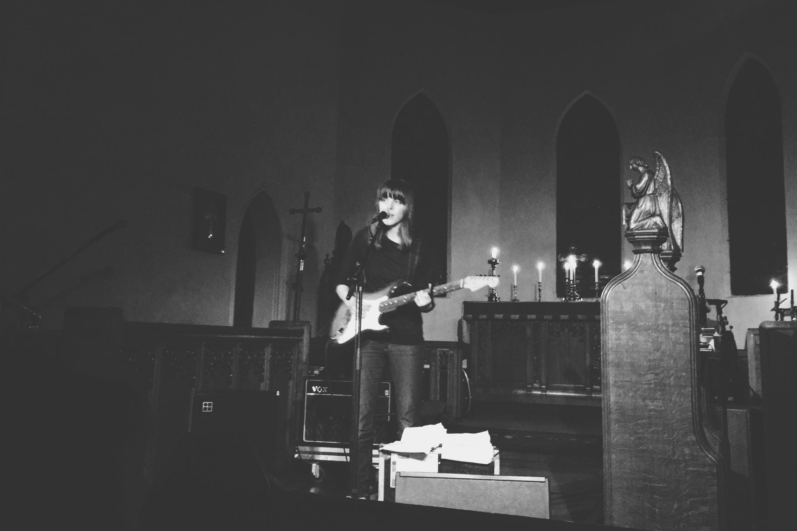

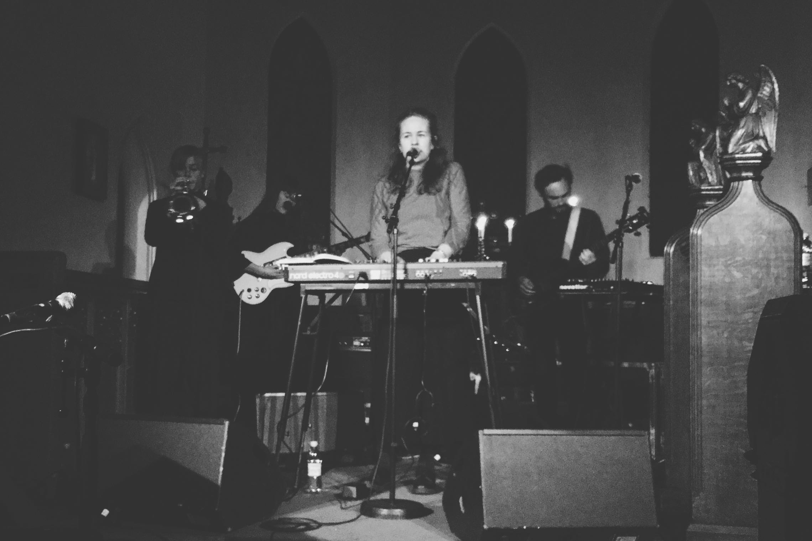

The next day we took the subway (T-banen) to Holmenkolmmen, visited the Ski Museum and took the elevator to the top of the ski jump tower (Holmenkollbakken). The biathlon world championship was while we were there, so there was a lot of action going on. On our way home we stopped at Fram musueum to learn about the history of polar expeditions and visit the boats that took the Norwegians to the poles.

In the evening we saw The Prettiots at Café Mono (photo), Holly Macvie at St. Edwards Church, Lafawndah at Internasjonalen (photo), Bright at Verkstedet, Palace Winter at Rockefeller (photo) and Skinny Girl Diet (photo) at Revolver.

On Sunday morning we visited the Opera and then Karin had to fly home, but since my flight was on Monday morning I spent the rest of the day wandering around Oslo, visiting Vigelandsparken and the national gallery.

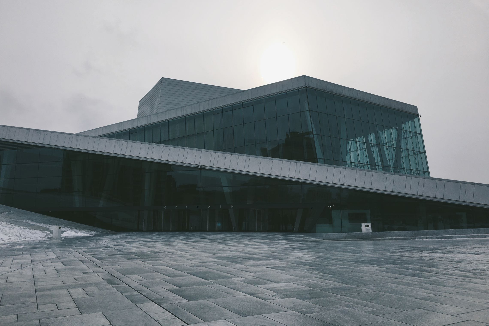

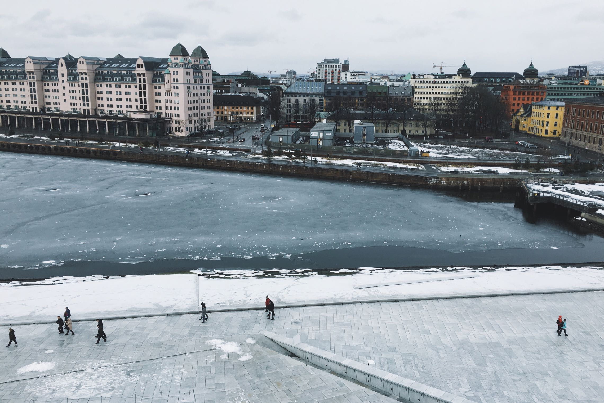

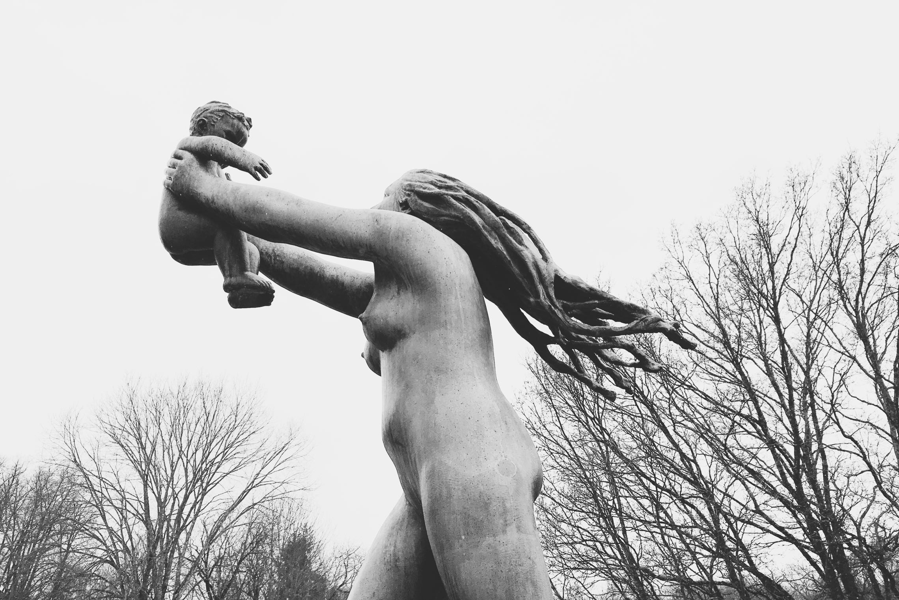

Thanks Oslo for an amazing time. And the next time we will be going way up to the north.

<video src="/video/oslo-bylarm-march-2016/IMG_4475.m4v" autoplay loop muted>
</video>
